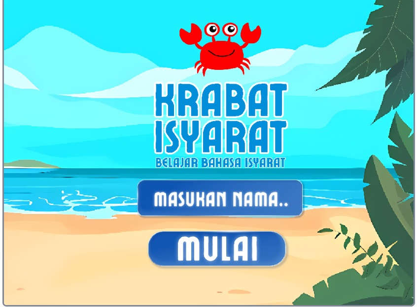
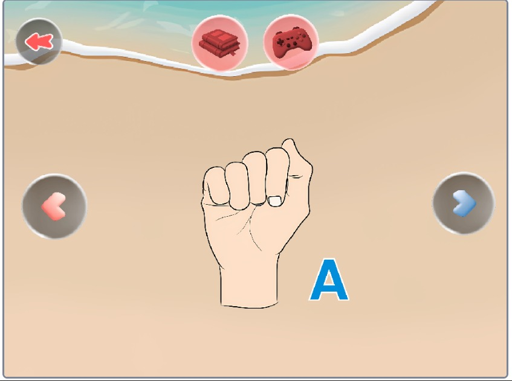
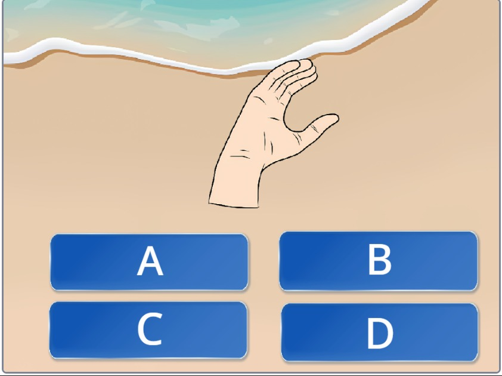
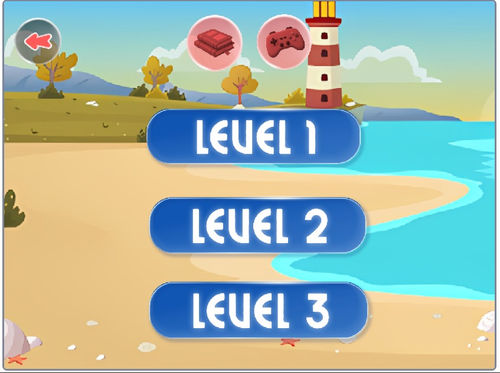

# 🦀 Krabat Isyarat

> **Belajar Bahasa Isyarat SIBI dengan Cara yang Menyenangkan**

Krabat Isyarat merupakan aplikasi/game edukasi berbasis Android yang dirancang untuk membantu anak-anak, remaja, dan masyarakat umum mempelajari **Sistem Isyarat Bahasa Indonesia (SIBI)** melalui pendekatan **Game-Based Learning**.

Dengan konsep **learning by doing**, pengguna dapat belajar bahasa isyarat secara interaktif melalui kamus visual, mini game, sistem level, dan karakter pendamping yang membuat proses belajar menjadi lebih menyenangkan.

---

## 📖 Tentang Aplikasi

Masih banyak masyarakat yang belum mengenal bahasa isyarat karena media pembelajaran yang tersedia cenderung kurang menarik dan sulit diakses.

Krabat Isyarat hadir sebagai solusi pembelajaran yang menggabungkan unsur **edukasi** dan **permainan**, sehingga pengguna dapat belajar bahasa isyarat secara bertahap tanpa merasa bosan.

Aplikasi ini dikembangkan menggunakan platform **Scratch** dengan metode pengembangan **Prototype**, sehingga berfokus pada pengalaman pengguna yang sederhana, interaktif, dan mudah dipahami.

---

# ✨ Fitur Utama

- 📚 Kamus Bahasa Isyarat Interaktif
  - Belajar alfabet
  - Belajar angka
  - Kosakata dasar SIBI

- 🎮 Mini Game Tebak Isyarat
  - Tebak arti gerakan
  - Latihan memahami bahasa isyarat
  - Belajar sambil bermain

- ⭐ Sistem Level
  - Materi bertahap
  - Tingkat kesulitan meningkat

- 🏆 Sistem Poin
  - Mendapatkan skor
  - Memotivasi proses belajar

- 🦀 Karakter Crabi
  - Pendamping selama proses pembelajaran
  - Membawa narasi yang inklusif

---

# 🎯 Tujuan

Krabat Isyarat dibuat untuk:

- meningkatkan minat belajar bahasa isyarat
- memperkenalkan komunikasi inklusif sejak dini
- membantu masyarakat memahami dasar-dasar SIBI
- mengurangi kesenjangan komunikasi dengan komunitas Tuli
- menghadirkan media belajar yang menyenangkan

---

# 📱 Platform

Saat ini aplikasi tersedia untuk:

- Android (.apk)

---

# ⬇️ Download APK

Silakan mengunduh versi terbaru melalui Google Drive:

**https://drive.google.com/file/d/1kL5RchWnDuC51RMc-VoOUajS7QJWQuJI/view?usp=sharing**

---

# 📸 Screenshot

Tambahkan screenshot aplikasi pada folder berikut:

```
assets/
├── home.png
├── kamus.png
├── game.png
├── level.png
└── reward.png
```

Lalu tampilkan di README menggunakan markdown:

```md
## Screenshot








```

---

# 🛠 Teknologi

- Scratch 3.0
- Scratch Block Programming
- Canva (Asset Design)

---

# 🚫 Source Code

Repository ini **tidak menyediakan source code**.

Krabat Isyarat merupakan proyek yang dipublikasikan hanya dalam bentuk aplikasi (APK).

Source code, asset pengembangan, maupun project Scratch (.sb3) **tidak dibagikan secara publik**.

---

# 🤝 Kontribusi

Saat ini proyek belum menerima kontribusi publik karena source code bersifat privat.

Namun, masukan, kritik, dan saran sangat kami apresiasi.

---

# 📄 Lisensi

Hak cipta © Krabat Isyarat.

Seluruh hak cipta dilindungi.

Aplikasi ini hanya diperbolehkan untuk digunakan sebagai media pembelajaran.

Dilarang mendistribusikan ulang, memodifikasi, atau memperjualbelikan aplikasi tanpa izin dari pengembang.

---

## ❤️ Visi

_"Belajar Bahasa Isyarat Hari Ini, Mewujudkan Komunikasi Inklusif Esok Hari."_
